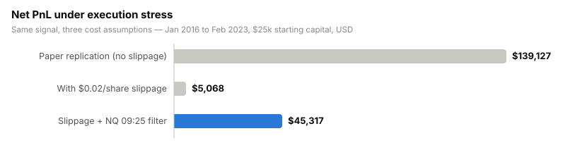
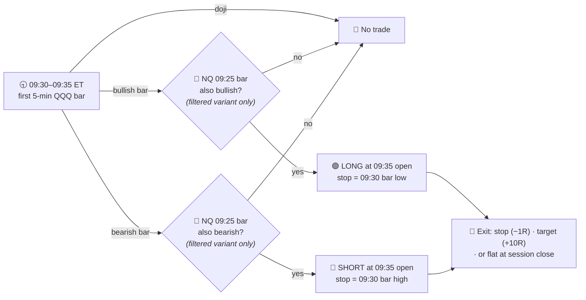
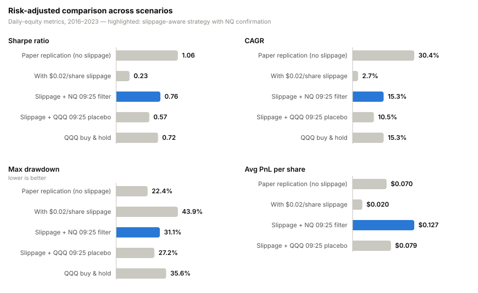
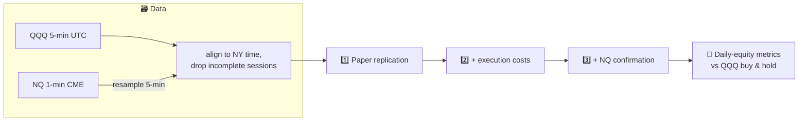

# 📈 QQQ Opening Range Bias — Replication & Execution Stress Test

[](https://www.python.org/)
[](https://jupyter.org/)
[](https://pandas.pydata.org/)
[]()

Independent replication of the **5-minute Opening Range Breakout on QQQ** from
[*Can Day Trading Really Be Profitable?* (Zarattini & Aziz, SSRN 4416622)](docs/ssrn-4416622.pdf) —
followed by two questions the paper never asks:

> **1. Does the edge survive realistic execution costs?** *(Mostly no.)*
> **2. Can a cross-market confirmation filter buy it back?** *(Partially — with caveats.)*

---

## 🧭 TL;DR

| | |
|---|---|
| 🎯 **Replication** | Paper's rules reproduced within noise: Sharpe **1.06** vs paper's 1.12, 1,771 trades vs 1,795 |
| 💸 **Key finding** | The gross edge is **$0.072/share** — just **$0.02/share** of slippage wipes out ~96% of net PnL |
| 🔀 **Recovery attempt** | Requiring the 09:25 NQ futures bar to agree halves trade count and lifts edge to **$0.126/share** |
| ⚠️ **Honest caveat** | The filter is selected **in-sample**; sample ends Feb 2023; not statistically distinguishable from buy & hold yet |

<picture>
  <source media="(prefers-color-scheme: dark)" srcset="assets/pnl_stress_dark.svg">
  
</picture>

*The single most important chart in the repo: the published result is an artifact
of assuming free execution. The strategy's per-share edge lives **inside** the
bid-ask spread.*

---

## ⚙️ Strategy rules

Evaluated on QQQ 5-minute bars, **Jan 2016 → Feb 2023**, $25,000 starting capital.



**Sizing & costs**

- Position size = `min(1% equity / $R, 4 × equity / entry)` — the paper's 1%-risk
  rule under a 4× FINRA day-trading leverage cap.
- Stress-test costs: **$0.02/share** on entry, **+$0.04/share** when a stop is hit
  (stops fire in the most volatile window of the day).
- Take-profit at **+10R** is rarely reached — in practice this is an
  *intraday momentum-continuation* strategy: hold the open's direction all day
  with a 1R stop.

---

## 📊 Results

<picture>
  <source media="(prefers-color-scheme: dark)" srcset="assets/metrics_dark.svg">
  
</picture>

### Full scenario table

| Scenario | Net PnL | Trades | Avg shares | PnL / share | Sharpe | CAGR | Max DD | Vol |
|---|---:|---:|---:|---:|---:|---:|---:|---:|
| 📄 Paper replication (no slippage) | $139,127 | 1,771 | 1,314 | $0.072 | 1.06 | 30.4% | 22.3% | 28.9% |
| 💸 With slippage | $5,068 | 1,771 | 489 | $0.022 | 0.24 | 2.8% | 43.2% | 29.3% |
| 🔀 Slippage + NQ 09:25 filter | $45,317 | 844 | 667 | $0.126 | 0.78 | 15.8% | 31.0% | 22.0% |
| 🧺 QQQ buy & hold | — | — | — | — | 0.72 | 15.2% | 35.6% | 23.4% |

**Reading the table**

1. The paper's headline numbers require >$300k notional per signal filled at
   mid with zero impact — an assumption, not a market.
2. Two cents of slippage turn a 30% CAGR into cash-drag territory and *worsen*
   the drawdown profile beyond buy & hold.
3. Conditioning on the 09:25 NQ bar (last 5 minutes of pre-open futures flow)
   roughly halves the trade count, concentrates on better entries, and restores
   risk-adjusted performance to ~buy-&-hold levels — **on the same sample the
   filter was designed on** (see limitations 👇).

---

## 🔬 Research pipeline



---

## ⚠️ Limitations & known issues (read before trusting any number)

This section exists on purpose — a backtest without its caveats is marketing.

- **In-sample filter selection.** The NQ confirmation was chosen after observing
  that slippage kills the baseline, and evaluated on the same 2016–2023 window.
  No out-of-sample split or walk-forward yet.
- **No significance testing.** 844 filtered trades; the Sharpe gap vs buy & hold
  (0.78 vs 0.72) is almost certainly not statistically significant. Per-trade
  t-stats and bootstrap CIs are on the roadmap.
- **The filter may not be "cross-asset" at all.** The 09:25 NQ bar ≈ QQQ's own
  pre-market momentum. A placebo test with QQQ's 09:25 pre-market bar is the
  obvious control experiment.
- **Stale sample.** Data ends Feb 2023. Post-2023 data is free out-of-sample
  evidence and the highest-value next step.
- **Cost model is a point estimate.** A PnL-vs-slippage sensitivity curve (and
  volatility-scaled stop slippage for gap days) would be more honest than a
  single $0.02 assumption.
- **Data-alignment artifact.** Bars where NQ is missing are dropped from *all*
  scenarios, so even the "paper replication" is conditioned on NQ availability
  (1,771 trades vs the paper's 1,795).
- **Source conflict of interest.** The original paper's authors run day-trading
  education businesses; published ORB results are known to concentrate in the
  high-volatility 2020–2022 regime.
- Sharpe is computed without risk-free subtraction; buy & hold benchmark is
  price-return (no dividends); commissions ($0.0005/share in the paper) are not
  modelled — individually small, collectively worth fixing.

---

## 🗺️ Roadmap

**Implemented — awaiting data to run** *(engine in [`src/backtest.py`](src/backtest.py), analyses in [`notebooks/QQQ_bias_v2.ipynb`](notebooks/QQQ_bias_v2.ipynb); engine smoke-tested on synthetic data, including deterministic accounting checks)*

- [x] Refactor the three copy-pasted backtest loops into one parameterised engine
- [x] Run the replication on unfiltered QQQ data (decouple it from NQ availability)
- [x] Whole-day session filtering, DST-safe NQ timestamps, commission modelling
- [x] Placebo test: QQQ 09:25 pre-market bar instead of NQ
- [x] Per-trade t-stat, bootstrap CI on Sharpe, per-year PnL breakdown
- [x] PnL-vs-slippage sensitivity curve

**Open**

- [ ] Re-run everything on real data and update the results above (numbers in this README are still from the v1 notebook)
- [ ] Extend the sample to 2023–2026 (true out-of-sample for both signal and filter)
- [ ] Volatility-scaled stop slippage for gap days
- [ ] Dividend-adjusted, risk-free-adjusted benchmark comparison

---

## 📂 Repository structure

```
├── 📄 README.md
├── 🖼️ assets/               # README charts (light + dark variants)
├── 🗃️ data/                 # place CSVs here — not versioned, see data/README.md
├── 📚 docs/
│   └── ssrn-4416622.pdf     # the paper being replicated
├── 📓 notebooks/
│   ├── QQQ_bias.ipynb       # v1 — original replication (kept for provenance)
│   └── QQQ_bias_v2.ipynb    # v2 — refactored engine + placebo, t-stats, bootstrap, sensitivity
├── 🧩 src/
│   └── backtest.py          # parameterised engine: data loaders, backtest, statistics
└── 📦 requirements.txt
```

## 🚀 Quickstart

```bash
python3 -m venv .venv && source .venv/bin/activate
pip install -r requirements.txt
# drop the two CSVs into data/ (schema in data/README.md)
jupyter lab notebooks/QQQ_bias.ipynb
```

Run the notebook top-to-bottom; assertions flag timestamp misalignment between
QQQ and NQ before any backtest runs.

---

## ⚖️ Disclaimer

Research artifact, not investment advice and not a production trading system.
Historical results — especially intraday results net of *assumed* costs — do not
guarantee future performance. Reconcile all data against a proprietary feed
before committing capital.
