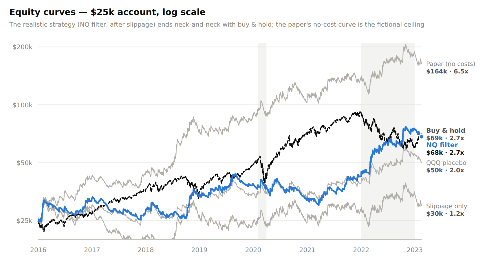
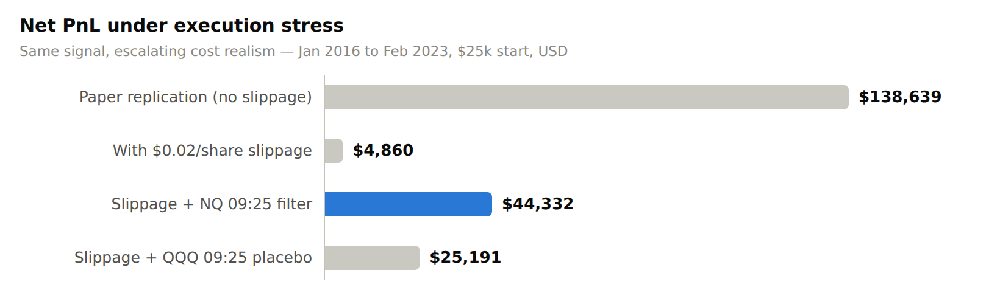
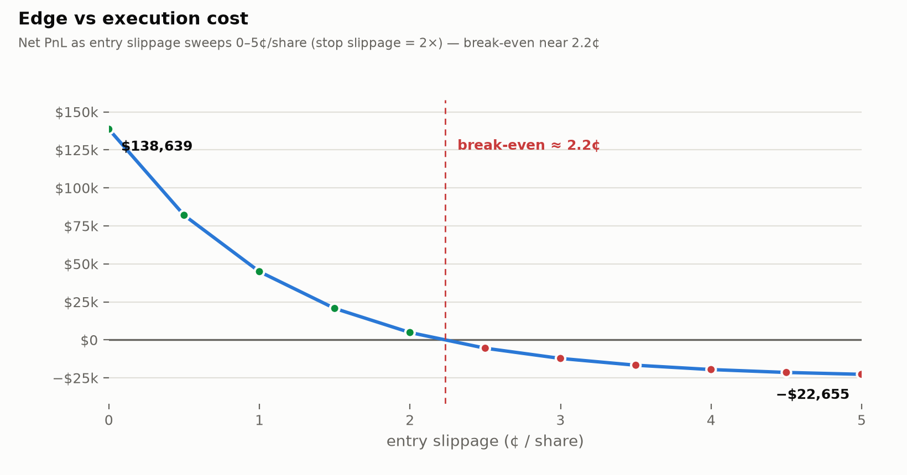
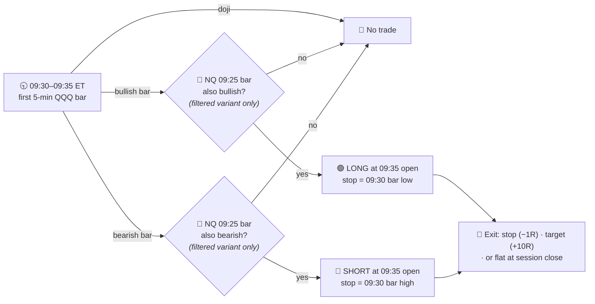
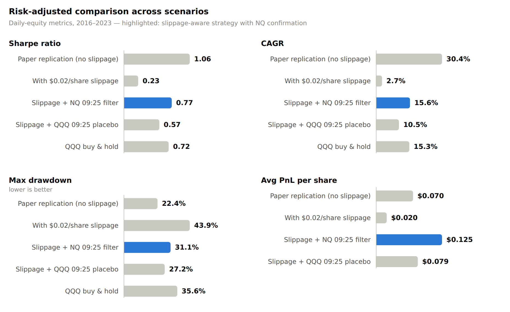
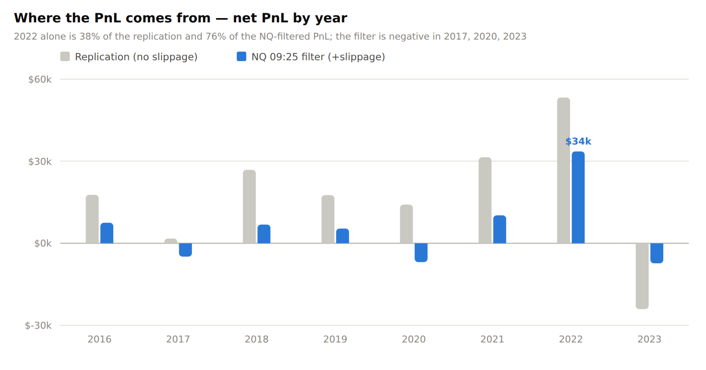

# 📈 QQQ Opening Range Bias — Replication & Execution Stress Test

[](https://www.python.org/)
[](https://jupyter.org/)
[](https://pandas.pydata.org/)
[]()

Independent replication of the **5-minute Opening Range Breakout on QQQ** from
[*Can Day Trading Really Be Profitable?* (Zarattini & Aziz, SSRN 4416622)](https://papers.ssrn.com/sol3/papers.cfm?abstract_id=4416622) —
followed by three questions the paper never asks:

> **1. Does the edge survive realistic execution costs?** → *Barely — break-even at ~2.2¢/share.*
> **2. Can a cross-market confirmation filter buy it back?** → *Partially, and it is more than a momentum proxy.*
> **3. Is the edge structural or a single-regime artifact?** → *Mostly a 2022 phenomenon.*

---

## 🧭 TL;DR

| | |
|---|---|
| 🎯 **Replication** | Reproduced within noise — **1,775 trades** (paper: 1,795), Sharpe **1.06** (paper: 1.12) |
| 💸 **Execution kills it** | Gross edge **$0.070/share**; net PnL crosses **zero at ~2.2¢/share** of slippage — the edge lives *inside* the bid-ask spread |
| 🔀 **NQ filter helps, and it's real** | Requiring the 09:25 NQ bar to agree lifts edge to **$0.125/share**, per-trade **t-stat 2.05** (significant); the QQQ-own placebo does not clear significance |
| ⚠️ **But it's fragile** | **76%** of the filtered PnL is 2022 alone; the filter loses money in 2017, 2020 and early 2023 |

<picture>
  <source media="(prefers-color-scheme: dark)" srcset="assets/equity_dark.png">
  
</picture>

*One picture, the whole thesis: the realistic strategy (blue) tracks buy & hold
almost exactly, while the paper's cost-free curve (gray, top) floats far above
anything achievable. Shaded bands mark the 2020 COVID crash and the 2022 selloff —
where most of the active edge is actually made.*

---

## 📉 The cost ladder

<picture>
  <source media="(prefers-color-scheme: dark)" srcset="assets/pnl_stress_dark.png">
  
</picture>

---

## 🔑 The headline chart: the edge is inside the spread

<picture>
  <source media="(prefers-color-scheme: dark)" srcset="assets/slippage_sensitivity_dark.png">
  
</picture>

The published $138,639 assumes **zero slippage**. Sweep entry slippage from 0 to
5¢ (stop slippage at 2×) and net PnL crosses zero at **~2.2¢/share**. Since QQQ's
bid-ask spread is ~1¢, this is not a comfortable margin — it is an edge that
survives or dies on execution quality. The paper's own assumption ("we assumed no
slippage in fills") is the single load-bearing input behind its headline result.

---

## ⚙️ Strategy rules

QQQ 5-minute bars, **Jan 2016 → Feb 2023**, $25,000 starting capital.



**Sizing & costs** — position size = `min(1% equity / $R, 4 × equity / entry)`
(1%-risk under a 4× FINRA day-trading cap). Stress-test costs: **$0.02/share**
entry, **+$0.04/share** on a stop. The **+10R target is nearly decorative** — it is
hit on only **~2–3%** of trades; **~75%** exit on the stop and **~22%** flat at the
close. In practice this is *intraday momentum-continuation with a 1R stop*.

---

## 📊 Results

| Scenario | Net PnL | Trades | PnL/share | t-stat | Sharpe | CAGR | Max DD |
|---|---:|---:|---:|---:|---:|---:|---:|
| 📄 Paper replication (no slippage) | $138,639 | 1,775 | $0.070 | 1.79 | 1.06 | 30.4% | 22.4% |
| 💸 With slippage | $4,860 | 1,775 | $0.020 | 0.52 | 0.23 | 2.7% | 43.9% |
| 🔀 Slippage + **NQ 09:25 filter** | $44,332 | 844 | $0.125 | **2.05** | 0.77 | 15.6% | 31.1% |
| 🧪 Slippage + QQQ 09:25 placebo | $25,191 | 825 | $0.079 | 1.27 | 0.57 | 10.5% | 27.2% |
| 🧺 QQQ buy & hold | — | — | — | — | 0.72 | 15.3% | 35.6% |

<picture>
  <source media="(prefers-color-scheme: dark)" srcset="assets/metrics_dark.png">
  
</picture>

---

## 🔬 What the data actually said

**1. The replication is exact.** Decoupling it from NQ data availability recovers
**1,775 trades vs the paper's 1,795** and Sharpe 1.06 — the earlier 1,771-trade
figure was an artifact of dropping bars where NQ was missing.

**2. The NQ filter is more than a momentum proxy — my prior was wrong.** The
control experiment replaces NQ with QQQ's *own* 09:25 pre-market bar (the placebo).
If the filter were just two-bar momentum, the two would match. They don't: NQ
delivers **$0.125/share (t = 2.05, significant at ~5%)** vs the placebo's
**$0.079/share (t = 1.27, not significant)**. The cross-asset signal carries
information beyond QQQ's own pre-open move.

**3. …but the portfolio-level edge over buy & hold is *not* established.** The
NQ-filter Sharpe (0.77) barely exceeds buy & hold (0.72), and their bootstrap 95%
CIs overlap heavily (NQ filter **[0.05, 1.41]**, buy & hold **[−0.03, 1.47]**). A
significant *per-trade* edge is not the same as a significant *strategy*.

**4. The edge is a single-regime phenomenon.** This is the finding that would
drive a prop risk review:

<picture>
  <source media="(prefers-color-scheme: dark)" srcset="assets/yearly_pnl_dark.png">
  
</picture>

**2022 alone is 76% of the filtered PnL** (and 38% of the replication). The filter
loses money in 2017, 2020 and early 2023. Strip out the 2022 high-volatility bear
market and there is little left — consistent with ORB edges being a
volatility-regime effect, not a structural one. The sharp 2023 drawdown also hints
the edge was already decaying at the end of the sample, which makes extending to
2023–2026 the highest-value next test.

---

## ⚠️ Limitations

- **In-sample filter selection.** The NQ filter was chosen and evaluated on the
  same 2016–2023 window. The significance tests above are honest but in-sample; a
  walk-forward or a true out-of-sample re-run is still owed.
- **Stale sample.** Data ends Feb 2023. Post-2023 data is free out-of-sample
  evidence and would directly test the 2023 decay signal.
- **Cost model.** Stop slippage is a flat $0.04; gap/halt days deserve
  volatility-scaled slippage. EoD exits are modelled as costless (defensible for a
  QQQ MOC, but stated explicitly).
- **Benchmark.** Buy & hold is price-return (no dividends, ~0.6%/yr); Sharpe is not
  risk-free-adjusted (non-neutral over the 2016–2023 rate path).
- **Source conflict of interest.** The original authors run day-trading education
  businesses; published ORB results are known to concentrate in 2020–2022 — which
  this replication independently confirms.

---

## 🗺️ Roadmap

**Done** *(tested package [`src/qqq_opening_bias/`](src/qqq_opening_bias), runner [`scripts/run_analysis.py`](scripts/run_analysis.py), notebook [`notebooks/QQQ_bias_v2.ipynb`](notebooks/QQQ_bias_v2.ipynb))*

- [x] Event-driven engine with a unit-test suite (`tests/`)
- [x] Replication decoupled from NQ availability → paper-matching trade count
- [x] Whole-day session filtering, DST-safe NQ timestamps, commission modelling
- [x] Placebo test (QQQ 09:25 bar) — NQ filter shown to add information
- [x] Per-trade t-stats, bootstrap Sharpe CIs, per-year breakdown
- [x] PnL-vs-slippage sensitivity curve → break-even ≈ 2.2¢/share

**Open**

- [ ] Extend the sample to 2023–2026 (true out-of-sample; tests the 2023 decay)
- [ ] Walk-forward / train–test split to de-bias the in-sample filter choice
- [ ] Volatility-scaled stop slippage for gap days
- [ ] Dividend- and risk-free-adjusted benchmark

---

## 📂 Repository structure

```
├── 📄 README.md · LICENSE · NOTICE.md · pyproject.toml
├── 🖼️ assets/                        # README charts (light + dark) + equity_curves.csv
├── 🗃️ data/                          # place CSVs here — not versioned, see data/README.md
├── 📚 docs/images/                   # standalone figures
├── 📓 notebooks/
│   ├── QQQ_bias.ipynb                # v1 — original replication (kept for provenance)
│   └── QQQ_bias_v2.ipynb             # v2 — narrative analysis on the package
├── 🧩 src/qqq_opening_bias/
│   ├── data.py                       # loaders + DST-safe NQ alignment
│   ├── backtest.py                   # event-driven engine (BacktestConfig / run_backtest)
│   ├── metrics.py                    # Sharpe / CAGR / drawdown / volatility
│   └── analysis.py                   # placebo, t-stat, bootstrap, per-year, sensitivity
├── 🧪 tests/                         # unit tests for the engine and the analysis
├── ⚙️ scripts/
│   ├── run_analysis.py               # reproduce every scenario + statistic from the CSVs
│   └── export_equity.py             # dump daily equity curves for the hero chart
└── 📦 requirements.txt
```

## 🚀 Quickstart

```bash
python3 -m venv .venv && source .venv/bin/activate
pip install -e .                      # installs the qqq_opening_bias package
python -m pytest                      # run the test suite (no data needed)

# drop the two CSVs into data/ (schema in data/README.md), then reproduce everything:
python scripts/run_analysis.py --qqq data/QQQ_5min_10years_UTC.csv --nq data/nq-10y-1min.csv

# or explore interactively:
jupyter lab notebooks/QQQ_bias_v2.ipynb   # Run ▸ Run All Cells
```

*Headline figures in this README come from `scripts/run_analysis.py` on the full
2016–2023 sample; a fresh run may differ by rounding.*

---

## ⚖️ Disclaimer

Research artifact, not investment advice and not a production trading system.
Historical results — especially intraday results net of *assumed* costs — do not
guarantee future performance. Reconcile all data against a proprietary feed before
committing capital.
