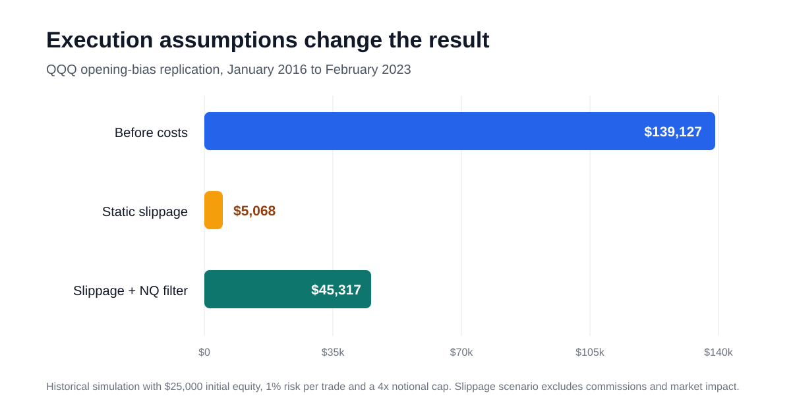

# QQQ Opening Bias

## Replication, execution-cost sensitivity and NQ confirmation

This project independently replicates the opening-range idea studied in
[Zarattini and Aziz, *Can Day Trading Really Be Profitable?*](https://papers.ssrn.com/sol3/papers.cfm?abstract_id=4416622).
It then asks a more important implementation question: how much of the apparent
edge remains after adding a simple execution-cost assumption?



## Main finding

The no-cost replication generated approximately **$139,127** of cumulative
P&L. Applying the notebook's static slippage assumption reduced that result to
approximately **$5,068**. An exploratory confirmation rule using the direction
of the 09:25 ET NQ futures bar increased modeled P&L to approximately
**$45,317**.

The result is not presented as a production-ready trading strategy. The NQ
extension was evaluated on the same historical sample and therefore does not
constitute independent out-of-sample validation.

## Research design

| Item | Specification |
|---|---|
| Instruments | QQQ ETF and CME Nasdaq-100 futures (NQ) |
| Sample | January 2016 to February 2023 |
| Bar frequency | 5 minutes |
| Signal | Direction of the 09:30 ET QQQ candle |
| Entry | 09:35 ET QQQ open |
| Stop | Opposite extreme of the 09:30 ET candle |
| Target | 10 times the initial per-share risk |
| Exit | Stop, target or the final bar of the same session |
| Position sizing | 1% of current equity at risk, capped at 4 times equity notional |
| Initial equity | $25,000 |
| NQ confirmation | Direction of the 09:25 ET NQ candle must match the QQQ signal |

When a stop and target are both touched inside the same 5-minute bar, the
backtest applies the conservative stop-first convention.

## Tested scenarios

| Scenario | Cumulative P&L | Trades | Average shares | Mean P&L per share |
|---|---:|---:|---:|---:|
| Replication before costs | $139,127 | 1,771 | 1,314 | $0.070 |
| Static slippage | $5,068 | 1,771 | 489 | $0.020 |
| Static slippage plus NQ confirmation | $45,317 | 844 | 667 | $0.126 |

The modeled slippage is **$0.02 per share on entry**, with an additional
**$0.04 per share when the stop is triggered**. It is a sensitivity assumption,
not an order-book or market-impact model. Commissions, taxes and borrow costs
are not included.

### Performance metrics

| Scenario | Sharpe | CAGR | Maximum drawdown | Annualized volatility |
|---|---:|---:|---:|---:|
| Replication before costs | 1.06 | 30.25% | -22.32% | 28.90% |
| Static slippage | 0.23 | 2.66% | -43.19% | 29.26% |
| Static slippage plus NQ confirmation | 0.78 | 15.82% | -31.03% | 21.98% |
| QQQ buy and hold | 0.72 | 15.25% | -35.63% | 23.41% |

These figures are historical backtest outputs stored in the executed research
notebook. Small numerical differences can arise from data revisions, timestamp
handling or changes to the input files.

## Interpretation

1. The attractive no-cost backtest is highly sensitive to execution
   assumptions.
2. After static slippage, the unfiltered specification is not economically
   compelling in this sample.
3. The NQ confirmation reduces the number of trades and improves average
   per-share P&L, but it remains an in-sample research extension.
4. The filtered result is close to QQQ buy and hold on Sharpe and CAGR, while
   retaining substantial drawdown. It should not be interpreted as evidence of
   a deployable alpha.

## Repository structure

```text
.
├── QQQ_bias.ipynb                 Original executed research notebook
├── docs/images/                   README figures
├── data/README.md                 Required schemas and data policy
├── scripts/run_analysis.py        Command-line runner for the three scenarios
├── src/qqq_opening_bias/          Reusable backtest and preprocessing code
├── tests/                         Synthetic-data unit tests
├── NOTICE.md                      Attribution and third-party notice
├── pyproject.toml                 Package metadata
└── requirements.txt               Research dependencies
```

The original notebook is retained as an executed research record. The
implementation under `src/` isolates the strategy rules so that they can be
tested on synthetic data independently of the private market-data files.

## Quickstart

```bash
python -m venv .venv
source .venv/bin/activate
python -m pip install --upgrade pip
pip install -e .

python -m unittest discover -s tests -v
```

To rerun the full historical analysis with your own files:

```bash
python scripts/run_analysis.py \
  --qqq Data/QQQ_5min_10years_UTC.csv \
  --nq Data/nq-10y-1min.csv
```

See [`data/README.md`](data/README.md) for the required columns and timestamp
conventions.

## Data policy

The historical QQQ and NQ files used in the research are not redistributed.
Users must supply data they are licensed to use. The repository includes input
schemas, preprocessing code, stored research outputs and synthetic tests.

The referenced SSRN paper is linked above and is not copied into this
repository.

## Limitations

- The NQ confirmation rule has no untouched out-of-sample evaluation period.
- Execution costs are static and do not use quotes, spreads, order-book depth,
  participation rate or nonlinear market impact.
- The analysis uses 5-minute OHLC bars, so the path inside each bar is unknown.
- The sample ends in February 2023 and does not establish current profitability.
- Continuous-futures construction and data-vendor revisions can affect the NQ
  confirmation series.
- The study does not include commissions, taxes, short-borrow constraints,
  rejected orders or partial fills.

## License and disclaimer

The original source code in this repository is released under the
[MIT License](LICENSE). Market data and third-party research are excluded from
that license.

This project is for educational and research purposes only. It is not
investment advice. Historical simulations do not predict future performance.
